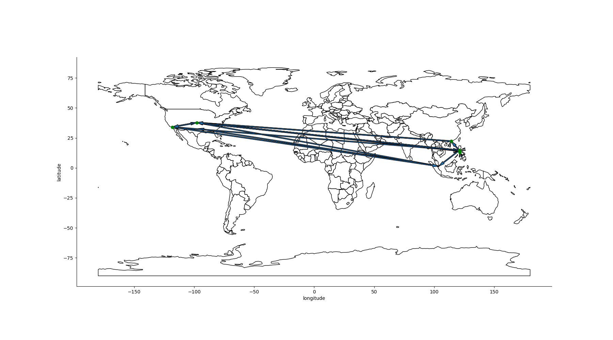
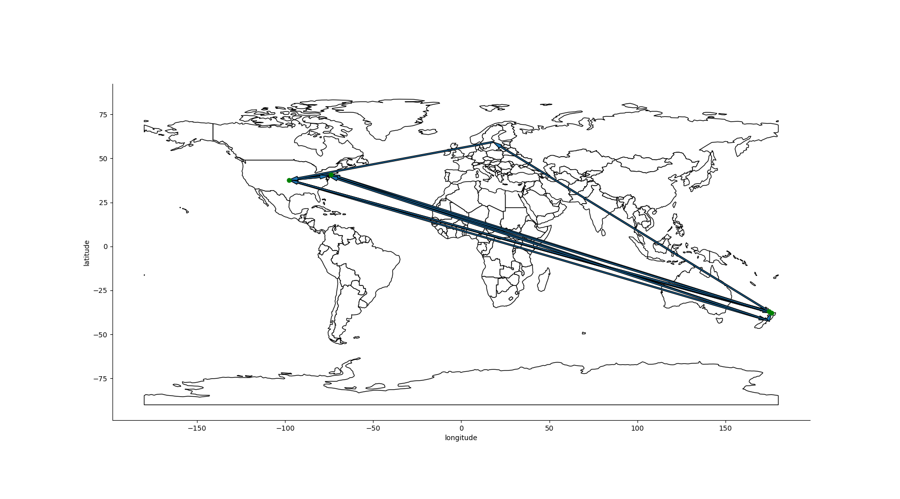
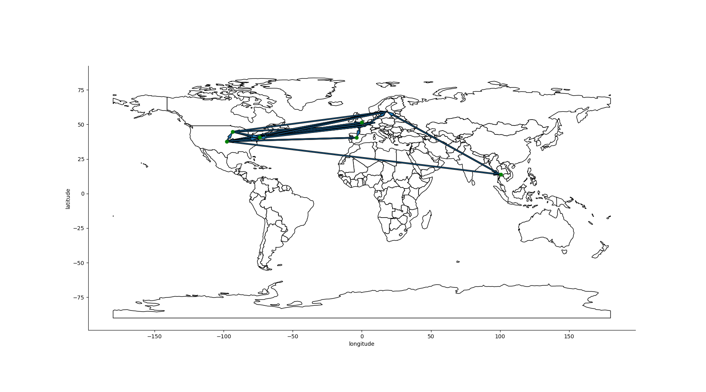
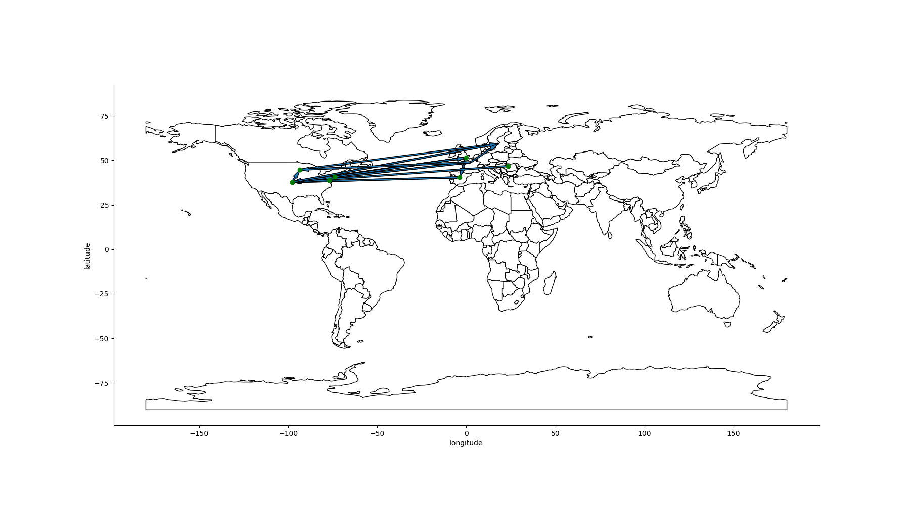

# Analysis of Traceroute Data

Target of Analysis is to determine if Starlink is performing efficient routing.

Following claims have already been made:
- Starlink does not route to the GS that is optimal in proximity and on direct
  geographical path.
- Starlink produces many hops
- Starlink uses Inter-Satellite Links (ISLs)

## Methodology

We collect the built-in measurement data from RIPE ATLAS on Starlink probes (ASN 14593).
[Data model is described here]. The data is made available in a PostgreSQL database.

The data gives evidence about the IP addresses used in the routing. We can determine
an approximate the packets take from that data. To find the geographical path the packets
take, we use the [MaxMind Database]. In the end, we can plot a geographical path of the
packets.

## Results

We analyzed the data for probes from the following countries:

- Philippines (PH)
- Kiribati (KI)
- Spain (ES)

### Philippines

The following paths were found for the Philippines:

01.01.2023 to 01.01.2024:

01.01.2024 to 01.07.2024:

There is no severe difference in the paths taken by the packets. Therefore, we can guess
there has not been any improvement to the infrastructure in the Philippines for Starlink
users.

Secondly, we also cannot observe routing to Japan. Previous research claimed that
Starlink routes their traffic over Japan, which could not observed in the data.
However, that does not mean it is not routed over Japan, as there might be invisible
hops.

Instead, we can observe routing over Hong Kong and Singapore.

A severe observation is traffic routing back to Asia from the USA. As the path seems to
be directed to the USA, this would significantly increase the latency. Either the reason
is compromised data in the RIPE ATLAS data or MaxMind data, or Starlink is not routing
the traffic efficiently.

### Kiribati

Similar results to the findings for the traceroute data in the Philippines were found for
Kiribati. For Kiribati, only data from 2024 was available.

01.01.2024 - 01.07.2024:

Kiribati is located to the south of Hawaii, to the North-West of Samoa (which is 
North-West of New Zealand). One would assume a route taken from Kiribati to a ground
station in Hawaii, but the traceroute data suggests a path taken over New Zealand. That
path would severely increase latency, as it increases the physical distance between
target and sender. The routing here is totally off.

### Spain

01.01.2023 - 01.01.2024

01.01.2024 - 01.07.2024

Similar results, but strong suggestion of ISL here. Some paths are taken without incoming
traffic. Strong suggestion that satellites routed the traffic there.

### Limitations

- MaxMind Database is wrong (what about Any Cast?)
- RIPE ATLAS traceroute data is compromised
- The plots indicate a geographical path with intermediate steps. That is not true.
  Only start and endpoint are known. Intermediate steps are not known.

[Data model is described here]: https://atlas.ripe.net/docs/apis/result-format/#version-5000-traceroute-v6-traceroute
[MaxMind Database]: ./ip_to_geolocation.md
