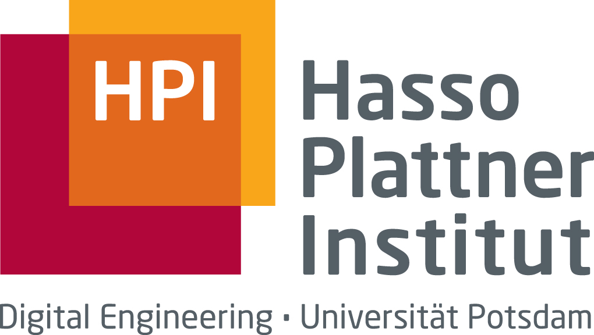

# Starlink Thesis

The master's thesis is about measuring the performance of Starlink. Written by _Robert Richter_ at the "Data-Intensive Internet Computing" chair of _Prof. Bajpai_ at the [Hasso Plattner Institute](https://hpi.de).

[Restricted Section](./restricted/_index.md)

## PDF Thesis

You can find the current state of the thesis here: [Starlink Thesis](/restricted/main.pdf).
_If you get a 404 response, you are most likely not signed in._

## Access Control

Please note that you have to be signed up for access the PDF or any restricted information. To do so, please write a mail to [robert.richter at student.hpi.de](mailto:robert.richter@student.hpi.de).

