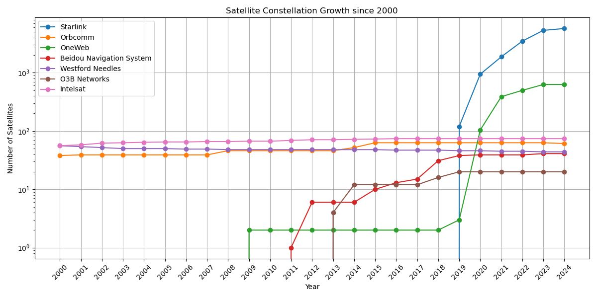

# Satellite Numbers per Constellation

It is in question how many satellites each private company has up there and how the numbers developed. This tool uses [N2YO](https://n2yo.com/database), a tool for tracking satellites.

It fetches all satellites using their individual Norad IDs. The Norad ID is a continuous numbers where each satellite holds a unique number starting at 1. The satellite with the number 1 is the rocket body of the first satellite ever launched, Sputnik 1. Sputnik 1 itself has the Norad ID 2.

## Results

In the end, the following results:



Please note that graphics uses a logarithmic scale, as Starlink has FAR more satellites than any other constellation. I decided to do so, as a linear scale rendered the graphic not usable.

## Interesting Files

- [´satellite-dev.png´](./satellite-dev.png): The graphic shown above.
- [´satellite-dev.csv´](./satellite-dev.csv): A CSV containing all satellites with their name, Norad ID, launch date, decay date, and classification.
- [´visualize-results.ipynb´](./visualize-results.ipynb): The Jupyter Notebook used to create the graphic.

## Running it Yourself

As always, get yourself an installation of Nix. Then, run the following command:

```bash
nix-shell satellite-numbers.nix
```

with the new terminal, run:

```bash
npm install && npm run build
```

This will crawl through all satellites, starting at the last one from `satellite-dev.csv`.
